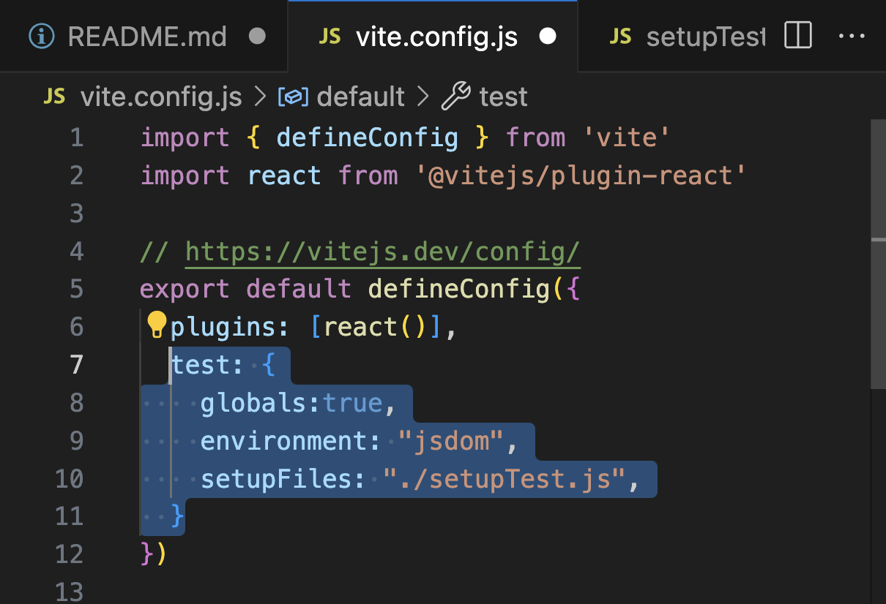
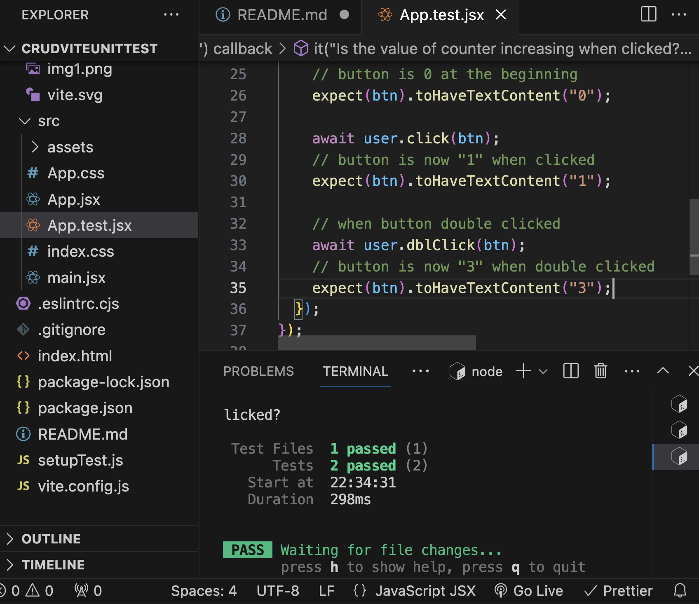
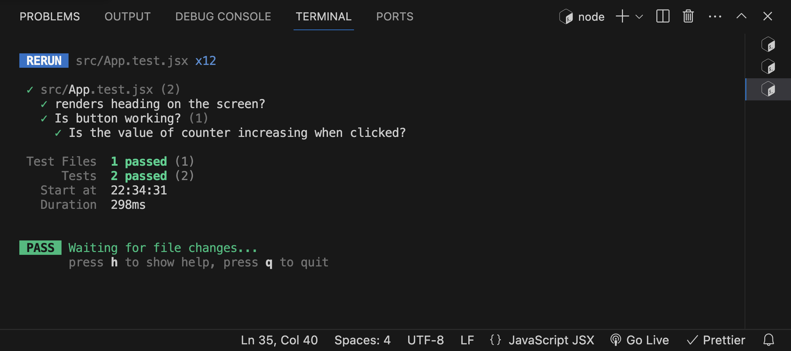

### Unit-test setup steps:

- npm create vite .

- npm i --save-dev jsdom

- npm i --save-dev @testing-library/jest-dom

- npm i --save-dev @testing-library/react

- npm i --save-dev @testing-library/user-event

- npm i --save-dev vitest

- add new file => `setupTest.js` (out of src)

#### setupTest.js => import(matchers,cleanup,expect and afterEach) and write these below before you start testing.

```
import * as matchers from "@testing-library/jest-dom/matchers";
import { cleanup } from "@testing-library/react";
import { expect, afterEach } from "vitest";

expect.extend(matchers);

afterEach(() => {
  cleanup();
});

```

- in order to execute the test, add the following section to your `package.json`

```````
{
    "scripts" : {
        "test": "vitest"
    }
}
``````

- write the following to the file `vite.config.js`

````
test: {

     globals:true,
     environment: "jsdom",
     setupFiles: "./setupTest.js",

  }

  ````


```


```


- add new file `App.test.jsx` (don`t write "js", write "jsx")


- (Don`t forget) npm test


## Screen View








```````
